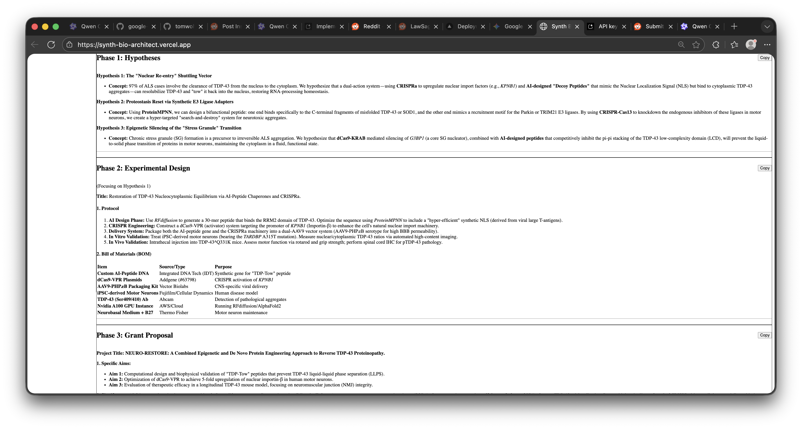

# Synth Bio Architect


An AI-powered tool for synthetic biology architecture and design, leveraging Google's Gemini API to generate research hypotheses, experimental designs, and grant proposals.

## Overview
Synth Bio Architect is a web application designed to accelerate the research process in synthetic biology. By integrating with Google's Gemini AI model, it helps researchers and bioengineers generate novel hypotheses, design detailed CRISPR/peptide experiments, and draft NIH-style grant proposals based on a simple research prompt.

The application provides a structured, three-phase output:
1.  **Phase 1: Hypotheses** - Generates three novel, grounded research directions.
2.  **Phase 2: Experimental Design** - Details a complete protocol and lists required reagents (Bill of Materials).
3.  **Phase 3: Grant Proposal** - Creates a draft proposal with a predicted impact score (0-100).

## Features
*   **AI-Powered Research Generation:** Utilizes the powerful `gemini-3-flash-preview` model to create high-quality, domain-specific content.
*   **Structured Output:** Parses AI responses into clear, organized sections for easy reading and copy-pasting.
*   **Real-time Streaming:** Content is displayed as it's generated by the AI, providing immediate feedback and a more engaging experience.
*   **Simple API Key Management:** Securely store and manage your Google API key within your browser.
*   **Markdown Rendering:** Outputs are rendered as clean, well-formatted Markdown for readability.
*   **One-Click Copying:** Copy any section of the generated output to your clipboard with a single click.
*   **Responsive Design:** Built with Tailwind CSS for a modern, clean interface that works on various screen sizes.
*   **Comprehensive Testing:** Includes a test suite for the core response parser.

## Technologies Used
*   **Frontend Framework:** Next.js 16 (App Router)
*   **UI Framework:** Tailwind CSS v4
*   **State Management:** React Hooks (useState, useEffect)
*   **AI Integration:** Google Generative AI SDK (`@google/genai`)
*   **Markdown Rendering:** `react-markdown` with `remark-gfm`
*   **Testing:** Vitest with jsdom
*   **Styling:** PostCSS with Autoprefixer
*   **Build Tool:** Vite (for testing)

## Getting Started

### Prerequisites
*   Node.js (v20.9.0 or higher)
*   npm or yarn

### Installation
1.  Clone the repository:
```bash
git clone https://github.com/your-username/synth-bio-architect.git
cd synth-bio-architect
```
2.  Install the dependencies:
```bash
npm install
```

### Configuration
1.  **Obtain a Google API Key:**
    *   Go to the [Google Cloud Console](https://console.cloud.google.com/).
    *   Create a new project or select an existing one.
    *   Enable the **Generative Language API**.
    *   Navigate to **APIs & Services > Credentials**.
    *   Create a new API Key. **Important:** For security, set appropriate API key restrictions (e.g., HTTP referrers) and configure billing and quotas.

2.  **Set the API Key:**
    *   Start the development server (see below).
    *   In the **sidebar**, paste your Google API key into the input field.
    *   Click the **Save Key** button. The key will be stored in your browser's `localStorage`.

### Running the Application
Start the development server:
```bash
npm run dev
```
Open your browser and navigate to `http://localhost:3000`.

### Running Tests
To run the test suite:
```bash
npm run test
```

## Usage
1.  **Enter your API Key:** Paste your Google API key into the sidebar and click "Save Key".
2.  **Describe Your Research:** In the main panel, enter a detailed description of your research challenge (e.g., "Find me a way to cure ALS using CRISPR and AI-designed peptides").
3.  **Generate:** Click the **Generate Research Plan** button.
4.  **Review & Copy:** As the AI generates the response, each section (Hypotheses, Experimental Design, Grant Proposal) will appear in real-time. Use the "Copy" button next to each section to copy the content to your clipboard.

## Project Structure
```
synth-bio-architect/
├── .gitignore
├── LICENSE
├── next.config.js
├── package.json
├── package-lock.json
├── postcss.config.js
├── tailwind.config.js
├── vitest.config.js
├── app/
│   ├── globals.css
│   ├── layout.js
│   └── page.js
├── components/
│   ├── MainContent.jsx
│   ├── OutputSection.jsx
│   └── Sidebar.jsx
├── app/lib/
│   ├── gemini.js          # Core API interaction logic
│   └── parser.js          # Parses AI response into structured sections
├── tests/
│   └── parser.test.js     # Tests for the response parser
└── screenshots/
    └── Screenshot-1-30-2026.png
```

## Security Note
The API key is stored in the browser's `localStorage`. While this is convenient for the user, it means the key is accessible via the browser's developer tools. **This is not a secure method for storing sensitive credentials in a production environment.**

*   **For Development/Personal Use:** This approach is acceptable for local testing and personal projects.
*   **For Production Deployment:** A backend server **must** be implemented. This server would handle API key management securely (e.g., using environment variables) and proxy all requests to the Gemini API, ensuring your key is never exposed to the client's browser.

## License
This project is licensed under the MIT License - see the [LICENSE](LICENSE) file for details.